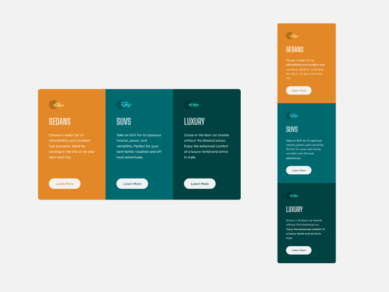
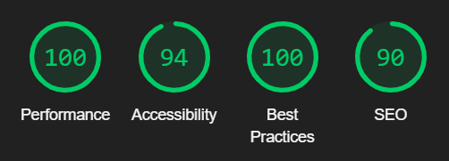

    

<h1 align='center'>3 Columns Preview Card Component from Frontend Mentor</h1>

    <h2>
      <a href='https://3-columns-preview-card-component-challenge.vercel.app/' target="_blank"> Live Version at Versel </a>
    </h2>

## <strong>The Challenge</strong>
One more challenge solved with HTML and CSS only. Despite the layout being very simple, this challenge was very interesting to incorporate a new concept that I learned, which is building layouts using CSS Grid.

## <strong>Technology Used</strong>

    &nbsp; 
    &nbsp;
    &nbsp;
    &nbsp; 
    

## <strong>My Process</strong>
As usual I started by configuring the project folder and initializing the version control system and gitignore file. Then I structured all the content sematically in HTML and proceeded to configuring style to desktop version using SASS pre-processor. After finishing the desktop version, I beging the mobile version using media queries. Finally, I finished with the Readme file and the adaptations of the HTML and CSS files according to the validation of the W3C Markup Validation Service website

### <strong>What I learned</strong>
Despite the layout of this challenge being very simple, I chose to do it in a different way, trying a new concept that I have learned which is <strong>CSS Grid</strong> as an alternative to Flexbox. I believe that I executed it very efficiently and I really liked the final result, both in the desktop and mobile versions, which also reinforces my bases of responsiveness in layouts with media queries.

### <strong>Useful resources</strong>
- [W3School References](https://www.w3schools.com/) - References to CSS and HTML 
- [MDN References](https://developer.mozilla.org/en-US/) - References to CSS and HTML 
- [W3C Markup Validation Service](https://validator.w3.org/#validate_by_input) - HTML5 and CSS3 code compliance check
- [Lighthouse Performance Check](https://developer.chrome.com/docs/lighthouse/overview/) - Google extension to check site metrics of performance, SEO, etc.
  
 

    

 

## <strong>Acknowledgments</strong>
I thank the entire Frontend Mentor team for making this platform available with such useful and important content for those who are starting to venture into this Web Developer career. Thank you very much (again) :v::slightly_smiling_face:

